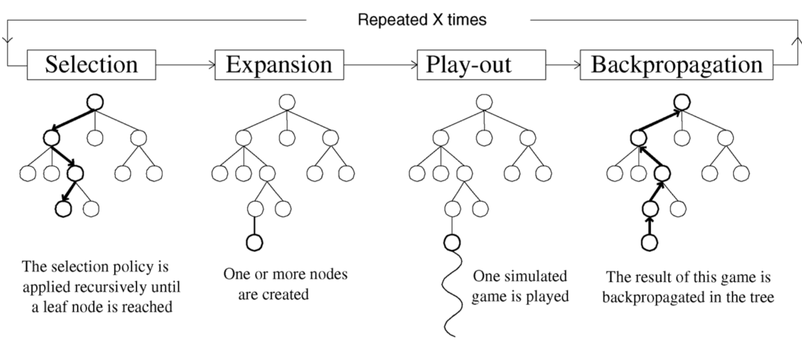
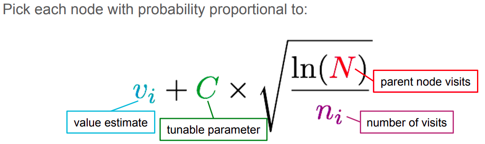

## Connect 4: Background

Connect Four is a two-player connection board game, in which the players choose a color and then take turns dropping colored tokens into a seven-column, six-row vertically suspended grid. The pieces fall straight down, occupying the lowest available space within the column. The objective of the game is to be the first to form a horizontal, vertical, or diagonal line of four of one's own tokens.

## Reinforcement learning approaches

In this article, we discuss two approaches to create a reinforcement learning agent to play and win the game.

### Deep Q Learning

Lorem ipsum dolor sit amet, consectetur adipiscing elit, sed do eiusmod tempor incididunt ut labore et dolore magna aliqua. Ut enim ad minim veniam, quis nostrud exercitation ullamco laboris nisi ut aliquip ex ea commodo consequat. Duis aute irure dolor in reprehenderit in voluptate velit esse cillum dolore eu fugiat nulla pariatur. Excepteur sint occaecat cupidatat non proident, sunt in culpa qui officia deserunt mollit anim id est laborum.

### Monte Carlo Tree Search

This approach speeds up the learning process significantly compared to the Deep Q Learning approach. Monte Carlo Tree Search (MCTS) excels in situations where the action space is vast. In the case of Connect 4, the action space is 7. As such, to solve Connect 4 with reinforcement learning, a large number of permutations and combinations of the board must be considered.

Monte Carlo Tree Search builds a search tree with n nodes with each node annotated with the win count and the visit count. Initially the tree starts with a single root node and performs iterations as long as resources are not exhausted.

There are 4 steps to a MCTS algorithm.

1. **Initial Setup** - Start with a single root (parent) node and assign a large random UCB value to each non visited (child) nodes.

2. **Selection** - In this phase, the agent starts at the root node, selects the most urgent node, applies the selected action, and continues until the final state is reached. To select the most urgent node, the upper limit of the node's trust limit is used. The node with the largest UCB is used as the next node. The UCB process helps overcome the dilemma of exploration and exploitation. Also  known as the multi-armed bandit problem, agents want to maximize their prizes during gambling (lifelong learning).

3. **Expansion** - When UCB can no longer be applied to find the next node, the game tree is expanded further to include unexplored child by appending all possible nodes from the leaf node.

4. **Simulation** - Once expanded the algorithm selects the child node either randomly or with a policy until it reaches the final state of the game.

5. **Backpropagation** - When the agent reach the final state of the game with a winner, all the traversed node are updated. The visit and win score for each nodes are updated.

The above steps are repeated for some iterations. Finally the child of the root node with the highest number of visits is selected as the next action as more the number of visits higher is the ucb.

The algorithm steps:
- Each iteration starts at the root
- Follows tree policy to reach a leaf node
- Node 'N' is added
- Perform a random rollout
- Value backpropagated up the tree

How the algorithm learns:
- Agents require more episodes to learn than Q-learning agents, but  learning is much faster.
- For simplicity, both trees share the same information, but each player has its own tree. We have found that this method is more rigorous  and  more flexible to  learn against other types of agents (such as Q-Learn agents and random agents).
- It takes about 800MB to store a tree of 1 million episodes  and grows as the agent continues to learn. Therefore, it goes far beyond CNN to remain constant throughout the learning process.

[//]: # "1. **Setup**. Start in the root of the tree (i.e. the state of the board) and assign large random upper confidence bound (UCB) values to each unvisited child node."

[//]: # "2. **Selection**. To pick a child node, use the following expression to identify which nodes have the most expected reward."

[//]: # "$w/n + c * \sqrt{ln(N)/n}$, where:"
    
[//]: # "$w$ = number of wins, $n$ = number of times the node is visited, $N$ = number of times the parent node is visited, $c$ = exploration/exploitation factor."

[//]: # "The above expression is the UCB function and is used to select the next move (node) for the game: the node with the highest UCB is selected."